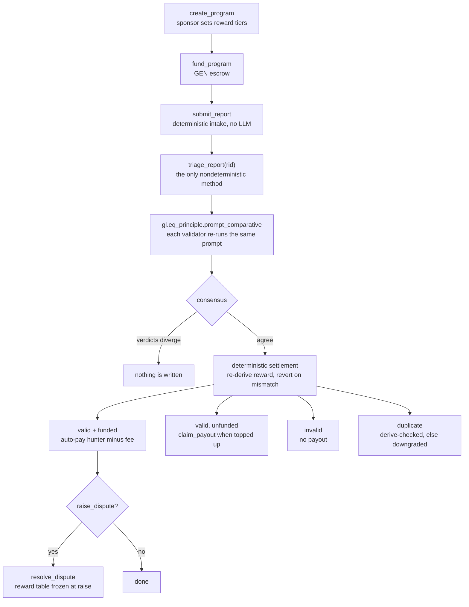

# BugBountyX — AI-Triaged Bug Bounty Primitive (GenLayer Intelligent Contract)

[](#testing)
[](#deploy--run)
[](#live-deployments)
[](contracts/BugBountyX.py)
[](#live-deployments)
[](LICENSE)

Standalone, reusable primitive for decentralized bug bounties: sponsors fund GEN
escrow per severity, hunters submit structured reports, GenLayer validators reach
LLM consensus on triage, valid reports auto-pay, disputes go to arbitration.

**Quick start**

```bash
git clone https://github.com/ibroiyi9901-design/BugBountyX.git && cd BugBountyX
python3.12 -m pytest tests/ -q                    # 10 passed
python3.12 scripts/preflight.py                   # 32/32 structural checks
GENVM_VERSION=v0.3.0-rc7 genvm-lint check contracts/BugBountyX.py   # lint + validation ok
```

## Table of contents

- [What it does](#what-it-does)
- [Live deployments](#live-deployments)
- [Why this is not a "thin LLM wrapper"](#why-this-is-not-a-thin-llm-wrapper)
- [How consensus works](#how-consensus-works-one-method-only)
- [State design](#state-design)
- [API reference](#api-reference)
- [Testing](#testing)
- [Deploy / run](#deploy--run)
- [Repository layout](#repository-layout)
- [Further reading](#further-reading)
- [Reuse ideas](#reuse-ideas)

## What it does



Everything except `triage_report()` is deterministic: intake, escrow math, fee
splits, status transitions, payouts, and arbitration never touch an LLM.

## Live deployments

| Role | Address | Deploy tx | Consensus on deploy |
|---|---|---|---|
| **Official** | [`0x82Bf017B38A4A4576b92A0442c33e79927F21298`](https://explorer-studio.genlayer.com/address/0x82Bf017B38A4A4576b92A0442c33e79927F21298) | `0x8933c4cf…76089` | 3 agree / 2 idle |
| Identical source | [`0x196b9a827ab4c616AD5210E6f9A9CD09a242D1d0`](https://explorer-studio.genlayer.com/address/0x196b9a827ab4c616AD5210E6f9A9CD09a242D1d0) | `0x6b9a90f4…82e3b9` | **5/5 agree** (FINALIZED) |

Open either in Studio with
[`?import-contract=`](https://studio.genlayer.com/?import-contract=0x82Bf017B38A4A4576b92A0442c33e79927F21298).
Both deployments run source that is **byte-identical** to this repo's contract
(sha256 `143a41e0…3f01`, 23262 bytes). Verify it yourself in one line:

```bash
curl -s -X POST https://explorer-studio.genlayer.com/api -H 'content-type: application/json' \
  -d '{"jsonrpc":"2.0","id":1,"method":"gen_getContractCode","params":["0x82Bf017B38A4A4576b92A0442c33e79927F21298"]}' \
| python3 -c 'import json,sys,base64; sys.stdout.buffer.write(base64.b64decode(json.load(sys.stdin)["result"]))' \
| cmp - contracts/BugBountyX.py && echo byte-identical
```

Sanitized receipts, empty-state reads, and the full hash live in
[`proof/`](proof/).

## Why this is not a "thin LLM wrapper"

| Reviewer concern | How BugBountyX answers it |
|---|---|
| Generic "AI decides X" | Triage is grounded in on-chain inputs only (scope + report + existing valid-report summaries). Validators re-run the same prompt independently. |
| Schema-only validation | Consensus is `gl.eq_principle.prompt_comparative` with a substantive principle (decision must match exactly, severity within one tier, **derived `reward` must be identical** — the GEN amount each verdict would pay). No `strict_eq` on LLM text. |
| Blind trust in LLM ids | Duplicate verdicts are **derived-checked**: the cited `duplicate_of` must exist, belong to the same program, and be `valid/paid` — else downgraded to `valid`. |
| Hallucinated JSON | Defensive parsing (`_clean`/`_norm`): dict passthrough, fenced-JSON stripping, substring extraction, key-variation tolerance (`decision` vs `is_valid`/`is_duplicate`), severity coercion. |
| Mixed nondet + money | LLM runs inside `triage_fn` only. All escrow math, fee splits, and status transitions are deterministic settlement **after** consensus. |
| Storage anti-patterns | `TreeMap`/`DynArray`-free index maps, `u256` atto-scale money, `@allow_storage` structs, appended-only layout. `dict`/`list`/`float` never touch storage. |

## How consensus works (one method only)

`submit_report()` is fully deterministic — no LLM, so intake is cheap and
censorship-resistant. `triage_report(report_id)` is the **only** nondeterministic
method:

1. Copy `Program` + `Report` to memory (`gl.storage.copy_to_memory` — storage is
   invisible inside nondet blocks).
2. Build a bounded dedup context (`_summaries`: last 60 reports, max 20 lines).
3. `triage_fn` calls `gl.nondet.exec_prompt(prompt, response_format="json")`,
   normalizes it, then derives `reward` deterministically from
   `severity + the program's reward table` (`_tier_payout`) and returns
   `{"decision","severity","duplicate_of","reason","reward"}`.
4. `gl.eq_principle.prompt_comparative(triage_fn, principle)` — every validator
   re-runs the prompt; an `EqComparative` LLM judge accepts only equivalent
   verdicts: identical `decision`, matching `duplicate_of`, severity within one
   tier, and **identical `reward`** — the exact GEN amount each verdict would
   pay — so tier-tolerant severity can never move the transferred amount.
   Divergent triage fails consensus and writes nothing.
5. Deterministic settlement: apply the decision (including the derived-check
   duplicate→valid downgrade), recompute the tier reward from stored tiers and
   require it to equal the consensus `reward` (any mismatch reverts — fail
   closed), auto-pay via `emit_transfer` (hunter gets `payout - fee`, owner gets
   fee), or leave `valid` claimable if escrow is underfunded.

All other writes (`create/fund/pause/resume/close`, `claim_payout`,
`raise/resolve_dispute`, admin) are deterministic.

## State design

- Counters: `next_program_id / next_report_id / next_dispute_id` (`u256`, start at 1; `0` = none).
- Maps: `programs`, `reports`, `disputes` (`TreeMap[u256, Struct]`).
- Indexes (O(1), no nested generics): `program_report_counts` + `program_report_index["pid:idx"]`,
  `hunter_report_counts` + `hunter_report_index["addr:idx"]`.
- Money: per-severity `u256` reward tiers + `escrow_bal` ledger per program; contract
  `balance` holds the pooled GEN, ledger prevents overspend.

## API reference

20 methods: 14 write, 6 view. Authorities: `owner` = contract owner,
`sponsor` = program creator, `hunter` = report submitter.

| Method | Type | Who | What |
|---|---|---|---|
| `create_program(name, scope, r_crit, r_high, r_med, r_low)` | write | anyone | Open program, returns `pid`. Rewards must descend. |
| `fund_program(pid)` | write.payable | sponsor | Add GEN escrow. |
| `pause_program / resume_program / close_program` | write | sponsor | Lifecycle; close refunds escrow. |
| `update_rewards(...)` | write | sponsor | Retier rewards. |
| `submit_report(pid, title, desc, poc, impact, sev)` | write | hunter | Deterministic intake, returns `rid`. |
| `triage_report(rid)` | write (consensus) | anyone | LLM triage + auto-pay. Returns decision dict. |
| `claim_payout(rid)` | write | anyone | Pay a `valid` report once funded. |
| `raise_dispute(rid, reason)` | write | hunter/sponsor | Freeze to `disputed`, returns `did`. |
| `resolve_dispute(did, outcome, sev)` | write | owner | Arbitrate + pay if `valid`. |
| `requeue_disputed(rid)` | write | owner/sponsor | Back to `pending` for re-triage. |
| `get_program / get_report / get_dispute` | view | anyone | Single struct as a primitive-only dict. |
| `get_program_reports(pid, offset, limit)` | view | anyone | Paginated report ids (JSON-array string to keep the ABI primitive). |
| `get_pending_queue(limit)` | view | anyone | Pending report ids (same convention). |
| `get_program_stats(pid)` | view | anyone | Counts, paid totals, escrow balance. |
| `set_fee / transfer_ownership` | write | owner | Fee ≤ 10%, ownership. |

## Testing

| Suite | Count | Covers | Command |
|---|---|---|---|
| Direct Mode (leader-only, mocked LLM) | 6 | create/fund/submit, auto-pay when funded, hallucinated duplicate downgraded, bad severity rejected, arbitration pays from the bound reward table, closed-program retier guard | `python3.12 -m pytest tests/direct -v` |
| Normalizer / helpers (no node) | 4 | fenced JSON, key variants, garbage + severity coercion, deterministic tier payout | `python3.12 -m pytest tests/test_normalizer.py -v` |
| Offline preflight | 32 checks | structural audit without a GenVM runtime | `python3.12 scripts/preflight.py` |
| Lint + schema validation | — | pinned runner, storage types, ABI | `GENVM_VERSION=v0.3.0-rc7 genvm-lint check contracts/BugBountyX.py` |

Everything in one go:

```bash
python3.12 -m pytest tests/ -q     # 10 passed (~0.2s)
```

## Deploy / run

```bash
genvm-lint check contracts/BugBountyX.py   # expect: lint ok
npm install -g genlayer
genlayer network set studionet
genlayer deploy --contract contracts/BugBountyX.py
# fund (2 GEN), submit, triage:
export BUGBOUNTYX=<deployed address>
genlayer write "$BUGBOUNTYX" fund_program '[1]' --value 2000000000000000000
genlayer write "$BUGBOUNTYX" submit_report '[1,"Reentrancy in Vault.withdraw","...","1. deposit 2. reenter...","funds drainable","high"]'
genlayer write "$BUGBOUNTYX" triage_report '[1]'
genlayer call "$BUGBOUNTYX" get_report '[1]'
```

Or run the whole lifecycle, including the dispute path, in one command:

```bash
BUGBOUNTYX_CONTRACT=<deployed address> scripts/smoke.sh --write
```

Read-only smoke (all 6 views, spends nothing):

```bash
BUGBOUNTYX_CONTRACT=<address> scripts/smoke.sh
```

Full annotated command sheet: [`DEPLOYMENT.md`](DEPLOYMENT.md).

## Repository layout

```text
contracts/BugBountyX.py    the primitive, 502 lines, single file
docs/                      architecture, consensus, integration, threat model
scripts/preflight.py       offline audit, no GenVM runtime required
scripts/smoke.sh           CLI read + write lifecycle smoke sequence
tests/direct/              Direct Mode: leader-only, mocked LLM (6 tests)
tests/test_normalizer.py   pure helpers vs adversarial LLM output (4 tests)
proof/                     sanitized live receipts, byte-identity, empty-state reads
examples/                  annotated end-to-end walkthrough + capture convention
artifacts/                 gltest build output (gitignored)
```

## Further reading

- [`docs/ARCHITECTURE.md`](docs/ARCHITECTURE.md) — layer separation, lifecycle, bounded cost, ABI discipline
- [`docs/CONSENSUS.md`](docs/CONSENSUS.md) — why `prompt_comparative`, the equivalence principle field by field, prompt-injection boundary
- [`docs/INTEGRATION.md`](docs/INTEGRATION.md) — consumer patterns, status semantics, owner/sponsor authority limits
- [`docs/THREAT_MODEL.md`](docs/THREAT_MODEL.md) — every threat, its mitigation, and the residual limitations
- [`DEPLOYMENT.md`](DEPLOYMENT.md) — lint, preflight, deploy, and the full annotated command sheet
- [`SUBMISSION.md`](SUBMISSION.md) — portal copy-paste description, evidence links, checklist

## Reuse ideas

Escrowed AI-judgment pattern ports to freelance deliverables, grant milestones,
retro-funding, and content-moderation payouts — swap the triage prompt + reward
tiers, keep the consensus/settlement split.

## License

[MIT](LICENSE)
